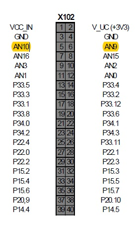
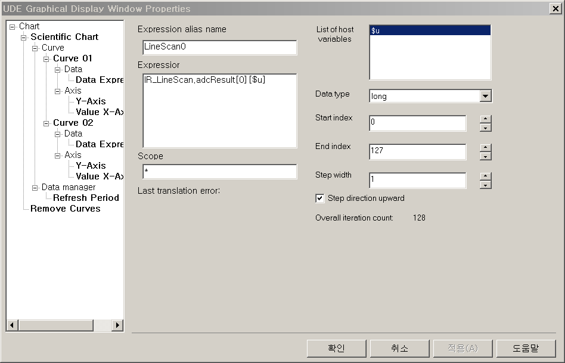
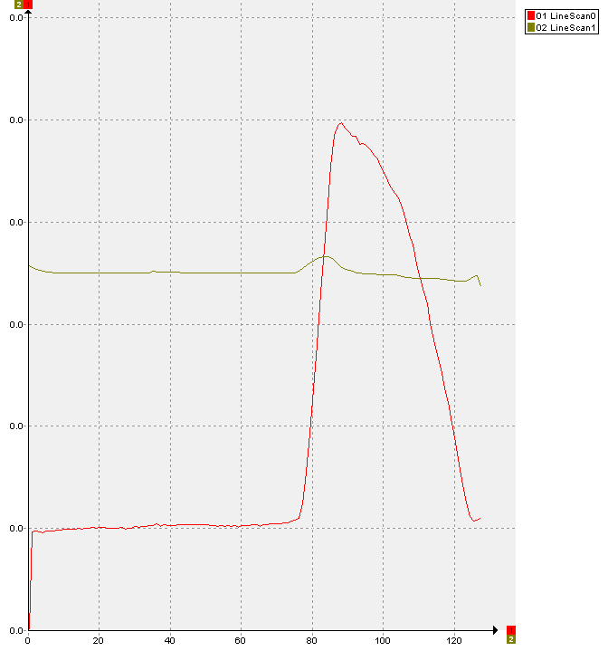
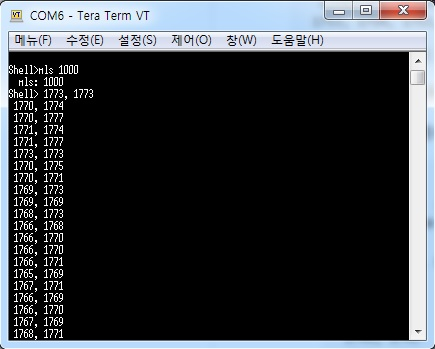
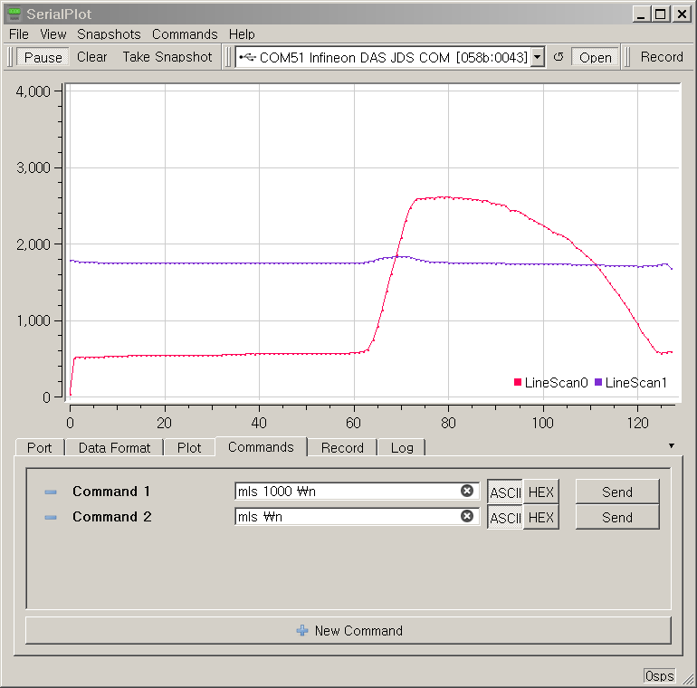

# Line Scan Camera (Optional)

**[알림]** 이 챕터는 TSL1401CL 이라는 Line Scan Camera를 저수준으로, 즉 하드웨어 신호를 고려하여 직접 프로그래밍 하는 방식으로, 인터페이스 하는 방법에 대하여 설명합니다.  만약 TSL1401CL을 사용할 것이 아니라면 굳이 이 챕터를 살펴보실 필요는 없습니다.

**[Pre-requisite]** [My own cheap oscilloscope](./MyOwnCheapOscilloscope.md)


## 시작하는 질문

* 카메라를 사용한다고? 그러면 영상 정보를 사용한다고? 마이크로컨트롤러에 카메라를 연결할 수 있는 것인가?  오잉? 이 카메라를 사용하려면 특정 펄스와 클럭 신호를 만들어 입력시켜야 한다네... 어떻게 해야 하나?


스마트 폰이 사용되면 반도체 센서들의 활용이 폭발적으로 늘어나게 되었습니다.  이전에 고가 장비 였던 GPS 센서, 지자계 센서, 가속도 센서, 근접 센서 등등, MEMS 기반의 센서들을 이제는 흔하게 사용할 수 있게 되었습니다.  지능형 자동차와 연관된 기술들이 개발 되면서 빛, 음파 등을 활용해서 거리, 색깔 등을 측정하는 센서들도 시작에 쏟아져 나오고 있습니다.  이미 상용화 되는 드론에는 이런 센서들이 목적과 용도에 맞게 수십개씩 탑재되고 있습니다.

지능형 모형차를 만드는데 꼭 필요하다 생각되는 센서 중에 TSL1401CL 기반의 Line Scan Camera 가 있습니다.  카메라가 맞습니다만, 단가와 마이크로컨트롤러와의 인터페이스를 고려하여 1차원, 직선만 읽어들이는 카메라 입니다.  지능형 모형차에 사용하기에 적당한 수준의 성능, 크기, 비용을 가지고 있습니다.  한가지 걸리는 것은 마이크로컨트롤러와의 인터페이스 부분입니다.  전용 프로토콜을 사용하고 있어서 이 센서를 사용하려면 저수준의 프로그래밍이 꼭 필요합니다.

그러나, 못할 것은 없습니다.  오히려 저수준 프로그래밍을 연습하는 기회로 삼아 봅시다.  마음의 준비 되셨습니까?  같이 한번 외쳐보고 시작해 봅시다. "도전!!!"


------


## Objectives

* TSL1401CL의 인터페이스 방식을 이해하고
* 저수준 드라이버 프로그램을 설계하고 구현한다.

## References

* TSL1401CL Data sheet
* iLLD_1_0_1_8_0_TC2xx_Drivers_And_Demos_Release - Modules/ VADC

**[Example Code]**

* AurixRacer_TC23A - TestLineScan
* AurixRacer_TC27D - TestLineScan

------


## Example Description

* 디지탈 출력 신호를 발생하여 SI, CLK 신호를 발생시키고
* VADC AutoScan 기능을 사용하여 AO 신호를 변환한다.
* 좌측 전방과 우측 전방에 각각 Line Scan Camera 를 장착할 것을 고려하여 2채널의 아날로그 신호를 입력받을 수 있도록 한다.


## TS1401 정보

대부분의 MEMS 기반 센서들은 마이크로컨트롤러와 인터페이스 하는 것에 SPI, IIC 와 같은 직렬통신을 사용합니다만 TS1401은 마이크로컨트롤러에서 클럭 신호를 발생해 주면 이 클럭 신호와 동기화 되어서 센서 값을 아날로그 출력으로 내보내 주는 전용 프로토콜을 사용합니다. 해상도(Resolution)는 128 pixels 이며, Pixel 간 간격(space)은 8 um입니다.


**Functional Block Diagram**


SI (Serial Port): Data output의 시작 시점을 정하게 됩니다.


CLK (Clock): 센서가 동작할 수 있도록 Clock을 입력하게 되며, clock과 동기화 하여 charge transfer, pixel output, 그리고 reset을 제어하게 됩니다.

AO (Analog Output): 센싱된 결과가 출력되는 포트 입니다.

: 입력 전압입니다.

GND: 접지를 나타냅니다.


Clock 주파수는 5kHz ~ 8000kHz의 범위를 가질 수 있고, SI 펄스가 입력되는 순간 부터 128 포인트의 측정결과를 AO 출력으로 내보냅니다.


SI의 rising edge에서 이전 사이클에서 계측된 128 pixels 정보를 AO에 내보내게 됩니다. 동시에 18 clock cycles 동안 모든 pixel들의 integrators를 초기화 합니다. 19 clock cycles부터 모든 pixel 값을 integration 하게 됩니다.

이전 사이클에서 계측된 값은 129 clock cycles이 되면 AO로 내보내는 것을 중단하게 됩니다. 현재 사이클의 계측된 값은 최소지연시간 이후 출력됩니다.


## iLLD - related

* Demo code description
  - ADC를 이용하여 Linescan camera로 부터 받은 아날로그 센서데이터를 디지털로 변환시켜 'conversionResult'라는 변수에 저장한다.

### Pin Configuration

* InfineonRacer 플랫폼 내 Configuration.h 파일을 보면  Line scan camera의 출력을 계측하는 analog channel이 9, 10 으로 설정되어 있습니다. 따라서, 2개의 Line scan camera를 사용할 수 있습니다. 또한, SI와 CLK 입력을 생성하기 위한 I/O가 각각 아래와 같이 설정되어 있습니다. SI와 CLK는 보통 주기적 신호로 내보내지기 때문에 타이머 모듈로 출력을 내보낼 수도 있습니다. 본 예제에서는 I/O와 time delay로 clock 신호를 만들어 주었습니다.
  * TC27D의 경우 analog channel이 0,1 로 설정되어 있습니다.
```c
// in Configuration.h
// AK 237
#define TSL1401_SI					IfxPort_P14_6
#define TSL1401_CLK					IfxPort_P14_7
#define TSL1401_AO_1				9
#define TSL1401_AO_2				10
// SB 275
#define TSL1401_SI					IfxPort_P14_0
#define TSL1401_CLK					IfxPort_P14_1
#define TSL1401_AO_1				0
#define TSL1401_AO_2				1
```

* 그리고, TC237 보드의 schematics 에서 analog channel 9, 10은 아래 pin에 mapping 되어 있습니다. 따라서, Line scan camera의 AO 출력을 아래 pin 중 한 곳에 연결시켜주어야 합니다. 



* TC 275 보드는 아래와 같이 analog channel 0,1의 pin에 연결해 줍니다.


* 주의할 점은 보드에서 ADC 값을 확인하기 전에  AO를 실제 오실로스코프로 확인하여 정상적인 전압 파형이 나오는 지 확인합니다. 만약, 전압 파형이 정상적으로 나오지 않는다면, line scan camera의 전원이 제대로 공급되는 지 확인하거나 배선에 문제가 없는 다시 한번 확인합니다. 최종적으로 전압 파형이 정상적으로 나오는 것을 확인 한 후 해당 pin에 연결합니다.


### Module Configuration

```c
void BasicLineScan_init(void)
{
	// Almost similar to VadcAutoScan except folling Pin configuration
    // AO_1, AO_2 pin으로 부터 Line scan 값을 받음
    // 이를 위한 adc channel configuration
        adcChannelConfig[chnIx].channelId      = (IfxVadc_ChannelId)(TSL1401_AO_1);
        adcChannelConfig[chnIx].resultRegister = (IfxVadc_ChannelResult)(TSL1401_AO_1);  

        adcChannelConfig[chnIx].channelId      = (IfxVadc_ChannelId)(TSL1401_AO_2);
        adcChannelConfig[chnIx].resultRegister = (IfxVadc_ChannelResult)(TSL1401_AO_2);  

    // for SI & CLK Signal **********************************************************
    // Line scan 값을 받기 위해서는 SI, CLK signal을 내보내야 함
    // 이를 위한 Port 초기 설정
    	IfxPort_setPinMode(TSL1401_SI.port, TSL1401_SI.pinIndex, IfxPort_Mode_outputPushPullGeneral);
		IfxPort_setPinPadDriver(TSL1401_SI.port, TSL1401_SI.pinIndex, IfxPort_PadDriver_cmosAutomotiveSpeed1);
		IfxPort_setPinState(TSL1401_SI.port, TSL1401_SI.pinIndex, IfxPort_State_low);

		IfxPort_setPinMode(TSL1401_CLK.port, TSL1401_CLK.pinIndex, IfxPort_Mode_outputPushPullGeneral);
		IfxPort_setPinPadDriver(TSL1401_CLK.port, TSL1401_CLK.pinIndex, IfxPort_PadDriver_cmosAutomotiveSpeed1);
		IfxPort_setPinState(TSL1401_CLK.port, TSL1401_CLK.pinIndex, IfxPort_State_low);

    }

```


### Module Behavior

```c
void BasicLineScan_run(void)
{
	uint32 chnIx;
	uint32 idx;

    // TSL1401 Operational waveform에 의거하여 SI, CLK의 signal을 내보냄
	IfxPort_setPinState(TSL1401_SI.port, TSL1401_SI.pinIndex, IfxPort_State_high);
	IfxPort_setPinState(TSL1401_CLK.port, TSL1401_CLK.pinIndex, IfxPort_State_low);
	waitTime(5*TimeConst_100ns);

	IfxPort_setPinState(TSL1401_SI.port, TSL1401_SI.pinIndex, IfxPort_State_high);
	IfxPort_setPinState(TSL1401_CLK.port, TSL1401_CLK.pinIndex, IfxPort_State_high);
	waitTime(5*TimeConst_100ns);

	IfxPort_setPinState(TSL1401_SI.port, TSL1401_SI.pinIndex, IfxPort_State_low);
	IfxPort_setPinState(TSL1401_CLK.port, TSL1401_CLK.pinIndex, IfxPort_State_high);
	waitTime(5*TimeConst_100ns);
    IfxVadc_Adc_startScan(&g_VadcAutoScan.adcGroup);


	for(idx = 0; idx < 128 ; ++idx)
	{
		// 200kHz로 Clk signal을 준다
		IfxPort_setPinState(TSL1401_SI.port, TSL1401_SI.pinIndex, IfxPort_State_low);
    	IfxPort_setPinState(TSL1401_CLK.port, TSL1401_CLK.pinIndex, IfxPort_State_low);
    	waitTime(3*TimeConst_1us);

    	IfxPort_setPinState(TSL1401_SI.port, TSL1401_SI.pinIndex, IfxPort_State_low);
    	IfxPort_setPinState(TSL1401_CLK.port, TSL1401_CLK.pinIndex, IfxPort_State_high);
    	waitTime(2*TimeConst_1us);

        /* check results */
        for (chnIx = 0; chnIx < 2; ++chnIx)
        {
            /* wait for valid result */
            Ifx_VADC_RES conversionResult;

            do
            {
                conversionResult = IfxVadc_Adc_getResult(&g_VadcAutoScan.adcChannel[chnIx]);
            } while (!conversionResult.B.VF);

            IR_LineScan.adcResult[chnIx][idx] = conversionResult.B.RESULT;
        }

	}

	IfxPort_setPinState(TSL1401_SI.port, TSL1401_SI.pinIndex, IfxPort_State_low);
	IfxPort_setPinState(TSL1401_CLK.port, TSL1401_CLK.pinIndex, IfxPort_State_low);
//	waitTime(1*TimeConst_10ms);

}
```


* Digital 출력 신호를 시간 지연을 사용해서 그린 것입니다.
  	* 타이머 2채널을 사용해서 두개를 동기화 하여 이와 같은 동작을 시킬 수도 있습니다.
  	* 이해를 위하여 직접적으로 신호를 발생시키는 방식으로 데모를 구성하였습니다.
  	* 명령어의 실행시간 등을 고려하여 약간의 실험적 튜닝도 필요합니다.
* 전체 1싸이클, 128 point, ADC 변환을 위하여 약 850usec 의 시간이 필요합니다.
  	* 2채널을 병렬적으로 실행시켰으므로 850usec의 시간 (1msec 보다 짧은 시간)에 카메라의 정보를 모두 변환할 수 있습니다.


## 실험 결과

* Line scan camera의 동작을 확인하기 위해 **좌측은 검은색, 우측은 흰색**의 종이를 두고 계측 실험을 하였습니다. 검은색 영역은 빛을 흡수하기 때문에 반사되어 오는 빛이 적거나 거의 없을 것이고, 반면 흰색 영역은 빛반사가 잘 일어나기 때문에 되돌아 오는 빛이 많을 것입니다.


### 라인스캔카메라의 출력

* 오실로스코프로 측정한 AO 출력은 아래 그림과 같습니다. 예상대로 센서 우측 영역에서 높은 전압이 발생되는 것을 확인할 수 있습니다.


### Debugger(UDE)를 사용한 측정 변수 확인

* UDE는 Array의 Data를 숫자 뿐만 아니라 그래픽하게 표현할 수 있는 기능도 있습니다. 
* Views 메뉴 밑에 Array Chart를 선택하고 아래와 같이 Array 변수인 `IR_LineScan.adcResult[][]` 의 값을 등록하여 그리도록 설정할 수 있습니다.
* Array 변수를 등록하고 축의 범위를 설정하면 아래의 그림과 같이 LineScan 값을 확인할 수 있습니다.
* 별도의 프로그래밍을 하지 않고 디버거의 기능만을 사용하여 변수값의 변화 양상을 확인할 수 있는 매우 유용한 기능입니다.






### Shell 명령을 이용한 확인

* Shell을 이용하여 변수값을 확인할 수 있는 기능도  구현되어 있습니다.

* 디버거를 사용할 수 없는 경우 유용하게 사용할 수 있습니다.


* **[Terminal을 사용한 경우]** Shell 에서 **mls** 를 이용하여  1000ms 마다 9, 10의 ADC 변환 값을 읽어온 것입니다.




- **[SerialPlot 프로그램을 사용한 경우]** 시리얼로 전송되는 값을 그래프로 확인할 수 있습니다. 




## 추가적인 설명

* 광학적인 특징

  	* 라인스캔카메라는 광학 장치이고 전면부에 렌즈 장착
  	* 렌즈의 초점 거리에 따라 측정되는 신호 특성의 차이가 큽니다.
  	* 초점 거리를 실험적으로 튜닝해야 합니다.

* 클럭 주기별 감광 특성 차이

  	* 당연히 주변광에 따라서 측정 전압의 차이가 큽니다.

  	* 같은 광학 조건이라도 라인스캔카메라에 공급되는 클락 신호의 주기에 따라 차이가 큽니다.

    * 주기가 크면 광량을 수집하는 시간이 길어지므로 어두운 곳에서도 측정 가능 합니다.

​    

------


## 마치며...

* 이번 시간을 통해 ADC를 이용하여 line scan camera의 센싱값을 digital로 측정하는 방법을 배웠습니다. 요컨대, 올바른 센서값 계측을 위해서는 아래 사항을 사전에 고려해야 합니다.
  * 센서 계측을 위한 동작 방법
  * 센서 출력 값의 전압 범위 및 주기
  * ADC 측정 해상도
* 무엇보다 임베디드 보드로 센서값을 계측하기 전에 하드웨어적으로 문제가 없는 지를 다시한번 확인하고  오실로스코프로 최종 확인을 하는 것이 중요합니다.

[](https://github.com/realsosy/aurixtutorial)