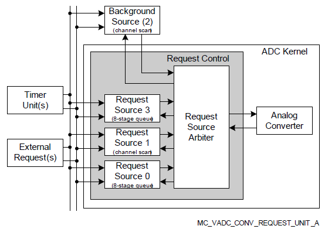
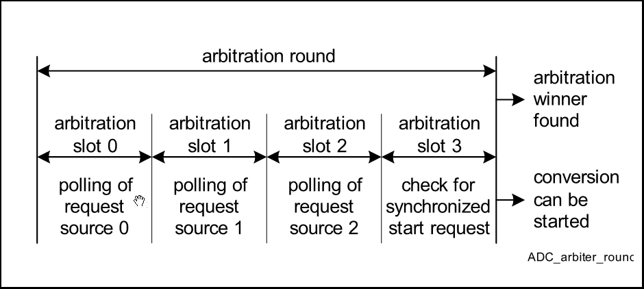
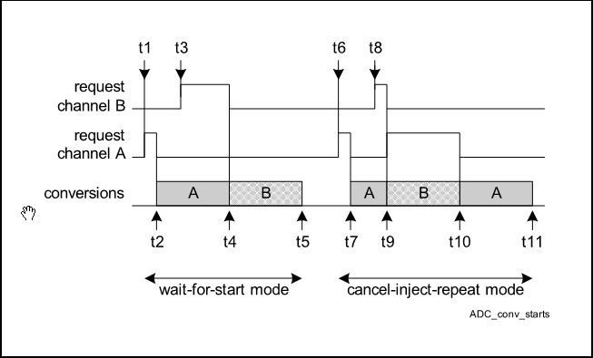
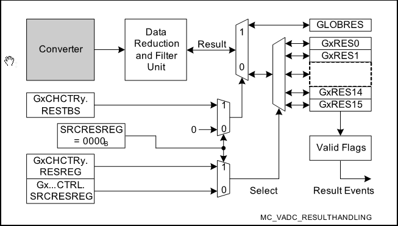
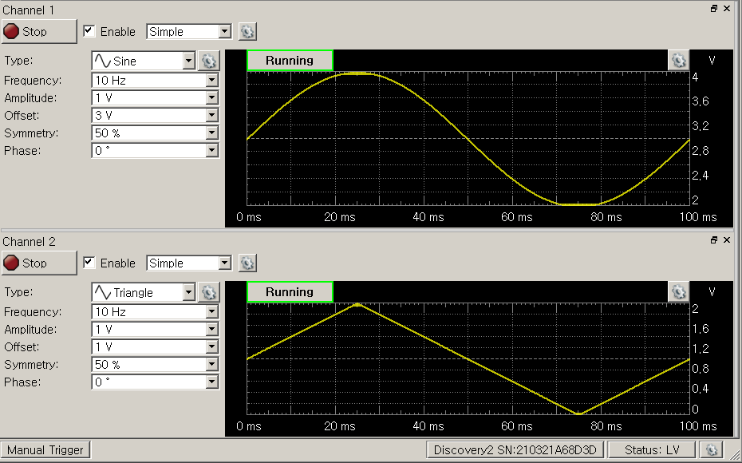
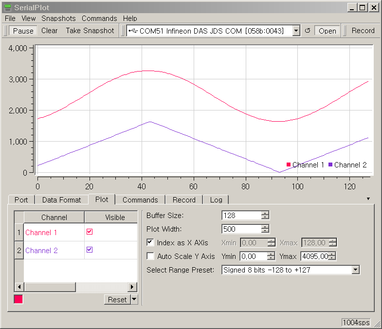

# My own cheap oscilloscope

**Pre-requisite**: [Multi channel voltmeter](../docs/MultiChannelVoltmeter.md)  


## 시작하는 질문

* 여러 채널의 아날로그 전압도 읽어들일 수 있게 되었는데.... 가만히 있어보자... 디지탈 신호처리에서도, 디지탈 제어에서도 **일정한 주기** 을 전제로 모든 설명을 했었는데.... VADC에서 샘플링 주기를 어떻게 결정할 수 있지?


전기전자 공학도가 가장 기본적으로 사용하는 계측기에도 위와 같은 고민이 반영되어 있습니다.  

* 디지탈멀티메터는 현재의 값을 보여주는 것을 목적으로 하고,
* 오실로스코프는 일정한 샘플링 주기를 가지고 트리거 조건을 전후해서 파형을 보여주는 것을 목적으로 하고 있습니다.

앞서 구성하였던 Multi channel voltmeter 예제에서는 주기를 전혀 고려하지 않았습니다.  그러나 디지탈 신호처리를 하려면, 디지탈 제어를 하려면, 샘플링 주기를 고려해야 합니다.  그러므로 ADC 모듈도 샘플링 타임을 고려해서 프로그래밍 할 수 있어야 합니다.

Converter 가 하나의 채널만 변환해야 할 경우에는 이 문제를 좀 쉽게 해결할 수 있습니다.  그러나 여러 채널을 변환해야 하는 경우라면, 그리고 그 채널들의 샘플링 주기가 다르다면 이 문제는 훨씬 복잡해 집니다.  VADC는 이 복잡한 문제를 체계적으로 해결할 수 있는 방안을 가지고 있습니다.   

------

## Objectives

* VADC의 Queue 기능과 Auto Scan 기능을 이해하고,
* 우선순위 결정 방법을 활용할 수 있도록 한다.


## References

* TC23x TC22x Family User's Manual v1.1 - Chap27 VADC
* TC27xD-step User's Manual v2.2 - Chap28 VADC
* iLLD_TC23A_1_0_1_8_0 - Modules/iLLD/VADC

**[Example Code]**

* MyIlldModule_AK_TC23A - VadcAutoScan
* MyIlldModule_SB_TC27D - VadcAutoScan
- MyIlldModule_AK_TC23A - VadcAsc
- MyIlldModule_SB_TC27D - VadcAsc

------


## Example Description

* 4채널의 아날로그 전압값을 0.5초 주기로 읽어들인다.


## Background

### Arbitration (중재)

* 공학용어 중에, 특히 Real-Time System 에서 자주 등장하는 말

* 의미를 전달하며 한글로 번역하기 어려운 단어

* 사전적 의미, 중재: 누가 무엇 때문에 싸움이 일어나서 중재가 필요하다는 말일까?

    * 통신 버스에 연결된 노드들 사이에서
    * ADC 변환을 기다리는 아날로그 채널들 사이에서
    * CPU의 처리를 기다리는 여러 인터럽드들 사이에서
    * OS의 서비스를 기다리는 여러 Task 들 사이에서

* 중재 방안: 중요한 것 먼저하자 (우선순위)

    * 급하다고, 여기 저기서 요청한다고, 공유된 자원(리소스)를 한순간에 두군데 이상에서 동시에 사용할 수는 없다.
    * 순서를 결정해 주어야 하고,
    * 그 순서를 결정하는 메카니즘을 잘 활용해서 효율을 높여주어야 한다.

* 중요하다는 말은 빨리 처리해야 한다는 말?

    * 일반적으로 중요하다는 말과 빨리 처리해야 한다는 말은 다른 말입니다.
    * Rate-Monotonic: 그러나 일반적으로 주기적으로 일어나는 사건들 사이에서는 빨리 처리해야 하는 일이 중요한 일이 됩니다
    * 좀 더 자세한 사항은 Real-Time System, 혹은 Real-Time OS 관련 교재를 참고하시기 바랍니다.

* VADC를 사용하여 여러 채널의 정보를 주기적으로 읽어 들여야 하는 경우에도

    * 동시에 변환을 요청하는 경우가 발생하고
    * 중재자(Arbiter)는 설계자가 부여한 우선순위에 따라 순차적으로 변환하게 됩니다.

  ​

## AURIX - related

### ADC 동작

* Conversion Modes
    * Fixed Channel Conversion (single or continuous)
    * Auto Scan Conversion (single or continuous)
    * Channel Sequence Conversion (single or continuous)
* Input channel selection
    * Multiplexer가 여러 개의 아날로그 입력 중 하나를 선택합니다.
    * 세 가지 소스들은 (Request source 0,1,3) linear sequence, arbitrary sequence, 또는 specific channel 중 선택 가능합니다.
 * Conversion control
    * 선택된 아날로그 입력은 conversion control 설정 값에 따라 변환되게 됩니다.
    * Conversion parameter는 4개의 input classes (2 group-specific classes, 2 global classes)에 설정됩니다.
    * 각각의 input channel들은 4개의 input classes 중 하나로 개별적 할당이 가능합니다.
 * Result handling
    * 변환 결과값은 16개의 group-specific result register 중 하나에 저장되고, 1개의 global result register에 저장됩니다.
    * Result register는 channels 그룹에 할당될 수도 있고, 단일 channel에만 할당될 수 도 있습니다.
 * Service request generation
    * ADC가 완료되면 완료 event를 CPU와 DMA에 알려주는 역할을 합니다.

    

### Modules for ADC

#### **Conversion request generation**

* Triggers: Software triggers과 External triggers로 나뉩니다.

* Operation modes: Single-shot과 Continuous 두 방법으로 각각의 request source가 동작될 수 있습니다.

* Types of request sources

    * Queued source: 입력 채널을 임의 순서로 변환하는 방식으로, 입력 채널 수 또는 순서는 자유롭게 변경 가능합니다.  채널 설정에 따라 매우 짧은 변환도 가능합니다. 스캔 순서는 queue buffer로 설정합니다.

    * Channel scan source: 입력 채널과 동일한 순서로 순차적으로 변환을 수행하는 방식입니다.


#### **Request source arbitration**

* Arbiter operation
    * Arbiter는 다수의 request source로부터 동시에 ADC 요청이 왔을 때 중재자 역할을 합니다.
    * Polling 방식으로 중재를 하며 중재 구간을 arbitration round라고 합니다.
    * Arbitration round는 다수 개의 arbitration slot으로 구성되어 있습니다.
    * 하나의 Arbitration slot에는 request source가 할당됩니다.
    * 또한, arbitration round에 몇 개의 arbitration slot이 포함될 지도 설정이 가능합니다. 최소 4개부터 20개까지 slot을 포함시킬 수 있습니다.
    * 사용자는 Arbitration slot은 duration을 설정할 수 있습니다.
    * 사용자는 각각의 request source의 우선순위를 정할 수 있습니다.
    * 아래 그림은 4개의 arbitration slot을 갖는 arbitration round를 나타냅니다.

		

* Conversion start mode
    * Arbitration winner는 현재 converter의 상태에 따라 어떻게 처리될 지 결정됩니다.
       * 만약, converter가 유휴 상태인 경우는 arbitration winner의 변환을 즉시 처리합니다.
       * 만약, converter에 변환 중인 request source의 우선 순위가 arbitration winner의 우선 순위보다 낮을 경우, 사용자 설정에 따라 다르게 처리됩니다.
       * Wait-for-start mode: 현 낮은 우선순위 ADC 완료 직후 높은 우선순위 ADC 수행
       * Cancel-inject-repeat mode: 현 낮은 우선순위 ADC를 중단하고, 높은 우선순위 ADC를 먼저 수행

    


#### **Analog input channel configuration**

* Analog 입력 채널을 사용하기 위해서 각 채널 별로 channel control register를 설정을 해 줄 수 있습니다.

    * Channel parameters: sample time과 result data width 설정 (8/10/12 bits)
    * Reference selection: alternate reference voltage 설정 가능
    * Result target: 변환 결과가 group result register 또는 global result register 중 한 곳에 저장되도록 설정
    * Result position: 결과 값이 left-aligned 또는 right-aligned 되도록 설정


#### **Conversion Timing and Result Handling**

* ADC 변환에 소요되는 시간은 다양한 사용자 설정에 따라 달라집니다.
    * ADC conversion clock frequency
    * Sample time
    * Operating mode (normal conversion / fast compare mode)
    * Result width (8/10/12 bits)
    * Post calibration time
* 일반적으로 변환 시간은 sample time, conversion steps, synchronization 시간을 모두 합한 시간을 말합니다.
* 변환 된 결과는 16개의 group result register 중 한 곳에서 저장되거나 global result register에 저장됩니다.
* 저장되는 위치는 어플리케이션의 사용 용도에 따라 사용자가 지정할 수 있으며, 보통 CPU load 나 DMA 전송의 성능을 최적화 할 수 있도록  설정합니다.

    


## iLLD - related

* Demo code description

  * Auto scan 기능을 이용하여 ADC변환 후 해당 그룹, 채널,그리고 변환된 실제 값을 출력합니다.


### Module Configuration

* 기본적인 설정 구조는 이전 장과 같음
* 그러나 이번엔 Background scan이 아닌 Auto scan을 enable 시켜볼 것

```c
void VadcAutoScanDemo_init(void)
{
    // VADC Configuration

	// ADC module configuration 생성
    IfxVadc_Adc_Config adcConfig;
    IfxVadc_Adc_initModuleConfig(&adcConfig, &MODULE_VADC);

    // ADC module configuration 초기화
    IfxVadc_Adc_initModule(&g_VadcAutoScan.vadc, &adcConfig);

    // Group configuration 초기화
    IfxVadc_Adc_GroupConfig adcGroupConfig;
    IfxVadc_Adc_initGroupConfig(&adcGroupConfig, &g_VadcAutoScan.vadc);

    // Group 0에 관련된 세부 설정 세팅
    adcGroupConfig.groupId = IfxVadc_GroupId_0;
    adcGroupConfig.master  = adcGroupConfig.groupId;

    // enable scan source
    adcGroupConfig.arbiter.requestSlotScanEnabled = TRUE;

    // Auto scan enable 설정
    adcGroupConfig.scanRequest.autoscanEnabled = TRUE;

    // enable all gates in "always" mode (no edge detection)
    adcGroupConfig.scanRequest.triggerConfig.gatingMode = IfxVadc_GatingMode_always;

    // 변경된 설정을 적용하기 위해 다시 초기화
    /*IfxVadc_Adc_Group adcGroup;*/    //declared globally
    IfxVadc_Adc_initGroup(&g_VadcAutoScan.adcGroup, &adcGroupConfig);

    uint32                    chnIx;
    // Channel configuration 생성
    IfxVadc_Adc_ChannelConfig adcChannelConfig[4];

    for (chnIx = 0; chnIx < 4; ++chnIx)
    {
      	// Channel configuration 초기화
        IfxVadc_Adc_initChannelConfig(&adcChannelConfig[chnIx], &g_VadcAutoScan.adcGroup);

      	// Channel configuration 설정
        adcChannelConfig[chnIx].channelId      = (IfxVadc_ChannelId)(chnIx);
        adcChannelConfig[chnIx].resultRegister = (IfxVadc_ChannelResult)(chnIx);  // use dedicated result register

        // 변경된 설정을 적용하기 위해 다시 초기화
        IfxVadc_Adc_initChannel(&adcChannel[chnIx], &adcChannelConfig[chnIx]);

        // add to scan
        unsigned channels = (1 << adcChannelConfig[chnIx].channelId);
        unsigned mask     = channels;
        IfxVadc_Adc_setScan(&g_VadcAutoScan.adcGroup, channels, mask);
    }

    //start autoscan
    IfxVadc_Adc_startScan(&g_VadcAutoScan.adcGroup);

}

```


### Interrupt Configuration

* 모듈 설정을 통해서 ADC 동작을 모두 자동으로 실행하도록 하였습니다.
    * 그러므로 ADC 변환과 관련해서 인터럽트를 발생해서 실행해야 하는 동작은 없습니다.
    * 사용자의 필요에 의해서 추가적으로 인터럽트를 발생시킬 수는 있습니다.


### Module Behavior

```c
void VadcAutoScanDemo_run(void)
{
    printf("VadcAutoScanDemo_run() called\n");

    uint32                    chnIx;

	// check results
	for (chnIx = 0; chnIx < 4; ++chnIx)
	{
		volatile unsigned     group   = adcChannel[chnIx].group->groupId;
		volatile unsigned     channel = adcChannel[chnIx].channel;

		// wait for valid result
		Ifx_VADC_RES conversionResult;

		do
		{
			conversionResult = IfxVadc_Adc_getResult(&adcChannel[chnIx]);
		} while (!conversionResult.B.VF);	// conversionResult.B.VF; 유효데이터임을 알려주는 valid flag

		volatile uint32 actual = conversionResult.B.RESULT;
		//print result, check with expected value
		{
			// FIXME result verification pending
			printf("Group %d Channel %d : %u\n", group, channel, actual);
		}
	}
}
```


```c
int core0_main(void)
{
	// ... 중간 생략
    // Demo init
    VadcAutoScanDemo_init();

    initTime(); // Initialize time constants
    // background endless loop
    while (TRUE)
    {
    	VadcAutoScanDemo_run();
        wait(TimeConst_100ms*5);
    }
}
```

* 주기적 샘플링 방법1 (사용하는 주기 = 샘플링하는 주기,  일반적으로 고속의 신호처리)
    * ADC 변환 자체를 주기적으로 실행하고
    * 변환이 마친 후 인터럽트 등을 실행하여 그 값을 처리하는 프로그램을 실행
* 주기적 샘플링 방법2 (사용하는 주기 >> 샘플링하는 주기, 일반적으로 제어시스템)
    * 이 예제에서는 ADC 는 자동으로 변환을 반복하도록 (AutoScan) 설정하여 두고
    * 사용자는 훨씬 늦은 주기로 이 값을 읽어 간다.


## 추가적인 설명

#### Oscilloscope로 사용하기

* **주기적 샘플링 방법2** 를 사용하여 데이터를 획득하고 사용하는 주기를 변경하여 Plot 하고 Data를 저장하면 Oscilloscope 처럼 사용할 수 있습니다.
* 물론 사용하는 주기 자체를 샘플링 주기로 변경하여 활용하는 것이 더욱 고속으로 Data를 얻고 세밀한 조정이 가능하지만, 자료획득시스템을 만드는 것이 목적이 아니라 제어에 사용되는 신호를 분석하기 위한 목적으로 사용하는 경우가 더 일반적이므로 **주기적 샘플링 방법2** 를 사용하여 Oscilloscope 기능을 구현해 보도록 하고자 합니다.
* Vadc 외에 필요한 것들
  * Graphic display: SerialPlot
  * Serial 통신: AsclinAsc Example
  * 주기적 동작: Stm Example
* Oscilloscope 처럼 파형을 출력하기 위해서는 Graphic 출력 화면이 필요합니다.  이 경우 PC Monitor를 사용하면 저렴하게 구성할 수도 있을 뿐더러 Open Source로 진행되고 있는 여러 프로젝트들 중에 선택하여 사용할 수도 있습니다.   PC에 직렬 통신으로 전송되어 오는 Data를 다양하게 출력할 수 있는 프로그램으로 SerialPlot 이라는 것이 있습니다.  이 프로그램을 사용하려면 직렬 통신으로 Data를 전송할 수 있어야 합니다.  Hello World 의 AsclinAsc 프로젝트에서 직렬통신으로 Data를 전송하고 수신하는 방법을 소개하였습니다.  이 기능들을 합치면 Oscilloscope 를 만들 수 있습니다.


#### Module Configuration

* AsclinAscDemo
    - 직렬통신에 필요한 초기화 설정기능 활용
    - MyOwnTerminal에서 진행했던 것과 같이 보드에 맞는 통신채널을 설정
```c
// in _AsclinAscDemo.c
  // Interrupt install; TC237의 경우 ASCLIN0 사용
#if BOARD == APPLICATION_KIT_TC237
  IFX_INTERRUPT(asclin0TxISR, 0, ISR_PRIORITY_ASC_0_TX)
  {
      IfxAsclin_Asc_isrTransmit(&g_AsclinAsc.drivers.asc);
  }

  IFX_INTERRUPT(asclin0RxISR, 0, ISR_PRIORITY_ASC_0_RX)
  {
      IfxAsclin_Asc_isrReceive(&g_AsclinAsc.drivers.asc);
  }

  IFX_INTERRUPT(asclin0ErISR, 0, ISR_PRIORITY_ASC_0_EX)
  {
      IfxAsclin_Asc_isrError(&g_AsclinAsc.drivers.asc);
  }

  // TC275의 경우 ASCLIN3 사용
#elif BOARD == SHIELD_BUDDY
  IFX_INTERRUPT(asclin3TxISR, 0, ISR_PRIORITY_ASC_3_TX)
  {
      IfxAsclin_Asc_isrTransmit(&g_AsclinAsc.drivers.asc);
  }

  IFX_INTERRUPT(asclin3RxISR, 0, ISR_PRIORITY_ASC_3_RX)
  {
      IfxAsclin_Asc_isrReceive(&g_AsclinAsc.drivers.asc);
  }

  IFX_INTERRUPT(asclin3ErISR, 0, ISR_PRIORITY_ASC_3_EX)
  {
      IfxAsclin_Asc_isrError(&g_AsclinAsc.drivers.asc);
  }
#endif

  // 중간생략
void AsclinAscDemo_init(void)
{
  // 중간생략
  // 직렬통신 및 interrupt priority 설정
#if BOARD == APPLICATION_KIT_TC237
    IfxAsclin_Asc_initModuleConfig(&ascConfig, &MODULE_ASCLIN0);
#elif BOARD == SHIELD_BUDDY
    IfxAsclin_Asc_initModuleConfig(&ascConfig, &MODULE_ASCLIN3);
#endif

#if BOARD == APPLICATION_KIT_TC237
    ascConfig.interrupt.txPriority    = ISR_PRIORITY_ASC_0_TX;
    ascConfig.interrupt.rxPriority    = ISR_PRIORITY_ASC_0_RX;
    ascConfig.interrupt.erPriority    = ISR_PRIORITY_ASC_0_EX;
#elif BOARD == SHIELD_BUDDY
    ascConfig.interrupt.txPriority    = ISR_PRIORITY_ASC_3_TX;
    ascConfig.interrupt.rxPriority    = ISR_PRIORITY_ASC_3_RX;
    ascConfig.interrupt.erPriority    = ISR_PRIORITY_ASC_3_EX;
#endif
    ascConfig.interrupt.typeOfService = (IfxSrc_Tos)IfxCpu_getCoreIndex();

    // 중간생략
    // pin configuration
#if BOARD == APPLICATION_KIT_TC237
    const IfxAsclin_Asc_Pins pins = {
        NULL_PTR,                     IfxPort_InputMode_pullUp,        // CTS pin not used
        &IfxAsclin0_RXA_P14_1_IN, IfxPort_InputMode_pullUp,        // Rx pin
        NULL_PTR,                     IfxPort_OutputMode_pushPull,     // RTS pin not used
        &IfxAsclin0_TX_P14_0_OUT, IfxPort_OutputMode_pushPull,     // Tx pin
        IfxPort_PadDriver_cmosAutomotiveSpeed1
    };
#elif BOARD == SHIELD_BUDDY
    const IfxAsclin_Asc_Pins pins = {
        NULL_PTR,                     IfxPort_InputMode_pullUp,        
        &IfxAsclin3_RXD_P32_2_IN, IfxPort_InputMode_pullUp,   
        NULL_PTR,                     IfxPort_OutputMode_pushPull,  
        &IfxAsclin3_TX_P15_7_OUT, IfxPort_OutputMode_pushPull,    
        IfxPort_PadDriver_cmosAutomotiveSpeed1
    };
#endif
```


* VadcAutoScanDemo
    - 4채널 변환 설정 초기화 설정기능과 각 채널의 변환값 읽어오기 기능 활용
    - VADC 초기화 과정에서 원하는 source를 input pin으로 설정
    - 결과를 지역변수가 아니라 전역변수로 읽어올 수 있도록 수정
```c
// in _VadcAutoScanDemo.h
typedef struct
{
    IfxVadc_Adc vadc; // VADC handle
    IfxVadc_Adc_Group adcGroup;
    uint16 adcValue[4];  // 결과값을 넣어 놓을 변수
} App_VadcAutoScan;
```
```c
void VadcAutoScanDemo_init(void)
{
    // 중간생략

    // 그룹 설정
#if BOARD == APPLICATION_KIT_TC237
    adcGroupConfig.groupId = IfxVadc_GroupId_0; // 237의 경우 Group0
#elif BOARD == SHIELD_BUDDY
    adcGroupConfig.groupId = IfxVadc_GroupId_1; // 275의 경우 Group1
#endif

    // 중간생략

    // 채널 설정
    for (chnIx = 0; chnIx < 4; ++chnIx)
{
    IfxVadc_Adc_initChannelConfig(&adcChannelConfig[chnIx], &g_VadcAutoScan.adcGroup);

    adcChannelConfig[chnIx].channelId      = (IfxVadc_ChannelId)(chnIx);
    adcChannelConfig[chnIx].resultRegister = (IfxVadc_ChannelResult)(chnIx);  

    // 중간 생략

}
```

```c
// in _VadcAutoScanDemo.c
void VadcAutoScanDemo_run(void)
{
    uint32                    chnIx;
	// check results
	for (chnIx = 0; chnIx < 4; ++chnIx)
	{
		// wait for valid result
		Ifx_VADC_RES conversionResult;
		do
		{
			conversionResult = IfxVadc_Adc_getResult(&adcChannel[chnIx]);
		} while (!conversionResult.B.VF);

		g_VadcAutoScan.adcValue[chnIx] = conversionResult.B.RESULT;  // 변환 결과값 저장
	}
}
```

* 각 Board에는 이 source에 맞는 pin과 converter가 맵핑되어있다.
  * TC237
    - 메뉴얼을 통해 확인
    

  * TC275
    - 아래 그림과 같이 AN10, AN11 채널을 이용
    
    


#### Module Behavior

* 예로 2채널의 값을 전송: `adcValue[0]`, `adcValue[1]`
* 일정주기 마다 loop 반복: `wait()` 함수 이용

```c
int core0_main(void)
{
    // Demo init
    AsclinAscDemo_init();
    VadcAutoScanDemo_init();
    initTime(); // Initialize time constants

    g_AsclinAsc.count = 4;
    // background endless loop
    while (TRUE)
    {
    	VadcAutoScanDemo_run();

        // Copy adcValue[] to txData[] &  Transmit data
        g_AsclinAsc.txData[0] = (uint8) ((g_VadcAutoScan.adcValue[0] & 0xFF00) >> 8);
        g_AsclinAsc.txData[1] = (uint8) (g_VadcAutoScan.adcValue[0] & 0x00FF);
        g_AsclinAsc.txData[2] = (uint8) ((g_VadcAutoScan.adcValue[1] & 0xFF00) >> 8);
        g_AsclinAsc.txData[3] = (uint8) (g_VadcAutoScan.adcValue[1] & 0x00FF);
    	IfxAsclin_Asc_write(&g_AsclinAsc.drivers.asc0, g_AsclinAsc.txData, &g_AsclinAsc.count, TIME_INFINITE);

        wait(TimeConst_1ms);
    }
    return 0;
}

```

#### SerialPlot 설정

* 위와 같이 전송 데이터를 설정하면 2byte의 데이터 2개가 전송되어 오게 됩니다.
* 각 데이터는 자료형이 `uint16`이고 각 자료는 Big Endian 으로 되어 있습니다.  (즉 lower byte 가  큰 address에 할당되는 방식)  이 설정을 맞춰 주어야 올바른 데이터 해석이 가능합니다.
* 미리 저장되어 있는 설정치를 불러와 사용할 수도 있습니다.
  * MyIlldModule_AK_TC23A/tool/SerialPlot.init
  * MyIlldModule_SB_TC27D/tool/SerialPlot.init


#### 파형측정 실험

* Function Generator를 사용하여 아래의 그림과 같이 2채널의 주기적 신호를 발생시키고 각각 Adc Channel 0 과 1 번에 연결하였습니다.
    * Function Generator Channel 1 => Adc Channel 0 에 연결
    * Function Generator Channel 2 => Adc Channel 1 에 연결
* SerialPlot를 사용하면 직렬 통신으로 전송되어 오는 데이터를 다음의 그림과 같이 출력하여 볼 수 있습니다.
    * 필요하다면 Snapshot으로 파형을 저장할 수도 있고
    * Data 자체를 파일로 Record 할 수도 있습니다.







------


## 마치며...

ADC의 성능을 이야기 하면서 숫자에 집착하여 채널이 많고, 변환속도가 빠르고, 분해능이 좋은 것만 중요하게 생각합니다.  그러나 하드웨어의 성능을 최대한 내기 위해서는 하드웨어를 잘 이해하고 용도에 맞게 설정하여 사용하는 소프트웨어적인 요소도 못지 않게 중요합니다.  

여러 채널의 데이터를 처리하기 위해서는 일반적으로 제어 알고리즘의 수행 주기보다는 훨씬 빈번한 AD 변환을 수행해야 합니다.  소프트웨어적으로 좋은 ADC는 CPU의 간섭,  즉 매 AD 변환마다 CPU가 관여해야 하는 부분을, 을 최소화 하고 ADC 가 알아서 스마트(?)하게 동작하여야 합니다.  VADC를 이렇게 스마트하게 사용하는 방법을 이해하게 되면서 더욱더 발전된 마이크로 컨트롤러 프로그래머로 성장해 갈 수 있을 것입니다.

이곳 에서 다루지 않은 내용으로는 하드웨어 타이머를 사용하여 특정 타이밍에  수~수십 usec 주기마다 AD 변환을 수행하는 기법이 있습니다.  모터 구동에서 전류 샘플링과 같이 PWM신호와 동기화 되어 매 주기마다 연산을 수행해야 하는 경우에 사용됩니다.  아울러 고속으로 특정 채널의 값을 연속적으로  ADC가 변환해 놓고 일정 주기 마다 이 변환값들을 일괄적으로 처리하는 기법 등이 있습니다.  이런 모든 경우에 VADC는 효과적으로 사용할 수 있는 쓸만한(?), 그러나 조금은 까탈스러운, ADC 입니다.

[](https://github.com/realsosy/aurixtutorial)
