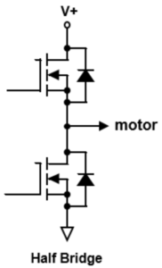
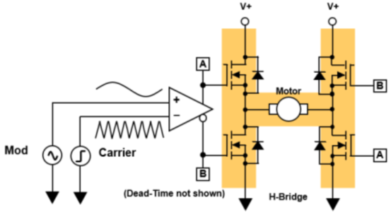
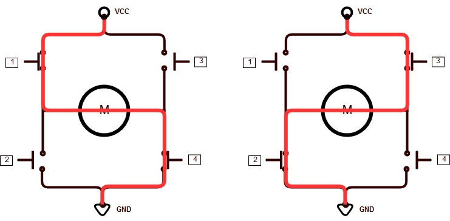
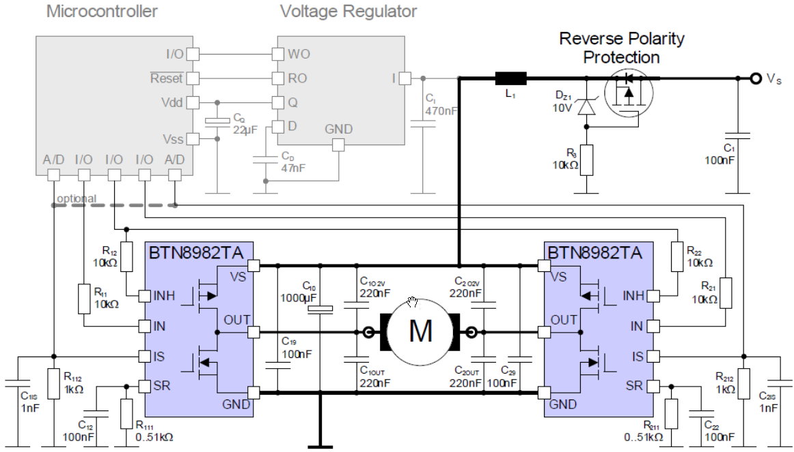
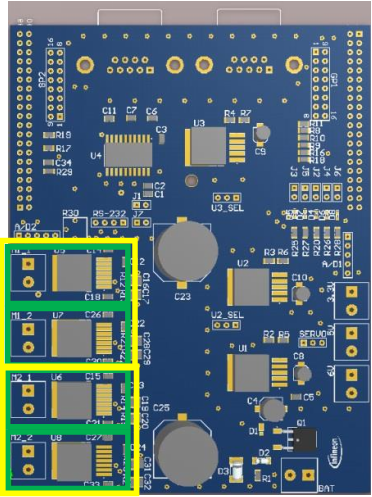
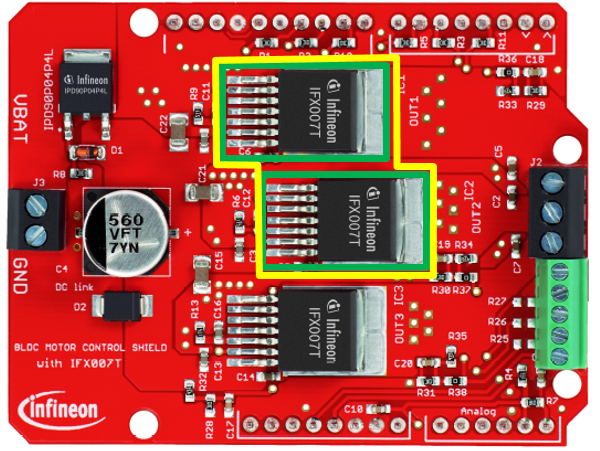

# Synchronized PWM


## 시작하는 질문


-	Synchronized Swimming 은 들어 보았는데 Synchronized PWM은 뭐지? 무엇이 동기화(Synchnoized) 되었다는 말이지? 어차피 PWM 신호라는 것이 밖으로 보이는 것도 아닌데 동기화 시켜서 예쁘게 보여야 할 이유가 있을까?

PWM이라는 것에 대해서 개략적인 내용은 이해했습니다. Pulse Width (도통시간: on-time)에 필요한 정보를 넣는 방법이지요. Synchronized 라는 것은 무엇일까요? 왜 필요할까요? DC 모터의 양방향 구동을 위해서는 H-bridge 라 불리는 전력소자 4개가 붙어있는 회로가 필요합니다. 이 4개의 전력소자를 적절히 켜고 끄고 함으로써, 즉 PWM 신호를 인가 함으로써, 전압를 자유자재로 조정할 수 있고 양방향 구동도 가능해 집니다. 단 이 PWM 신호들이 서로 독립적이지 않고 의존적으로 사용되어져야 합니다. PWM 신호들 한 주기 내에서 조화롭게 만들어 져야만 H-bridge 가 성능을 낼 수 있습니다. AURIX는 이를 위해서 Synchronized PWM 출력기능을 가지고 있습니다. 이 예에서는 DC 모터를 위한 H-bridge의 경우에 대해서 설명하고 있습니다만, 이 내용이 확장되어 3상 모터, 즉 BLDCM(Blush-Less DC Motor)와 PMSM(Permanent Magnet Synchronous Motor)를 위한 인버터 구동신호에 활용될 수 있습니다.


## Objectives


-	Bipolar PWM을 이용한 모터 제어 방법
-	BTN8982TA (Half bridge 모터드라이버) 기능 및 사용법
-	H-bridge 모터드라이버 구성 및 Synched PWM을 이용한 작동 방법

## References


**[Application kit TC237]**

-	tc23x_tc22x_um_v1.1 - Chap 24 Generic Timer Module (GTM)

-	Infineon-Motor_Control_Shield_with_BTN8982TA_for_Arduino-UM-v01_00-EN

-	Infineon-BTN8982TA-DS-v01_00-EN

**[Shield buddy TC275]**

-	tc27xD_um_v2.2 - Chap 25 Generic Timer Module (GTM)

-	Infineon-Motor_Control_Shield_with_IFX007T_for_Arduino-UM-UM-v01_00-EN

-	Infineon-IFX007T-DS-v01_00-EN

**[Example Code]**

-	MyIlldModule_SB_TC27D/0_Src/AppSw/MyilldModule/GtmTomPwmHl

---

## Example Description


-	GtmTom을 이용하여 PWM을 생성하고, 생성된 PWM을 이용하여 모터 드라이버를 구동시켜 봅니다.

## Background 정보


-	DC 모터 제어 방법하기 위해 인버터가 사용되는 데 인버터를 구성하는 방식으로는 Switch 소자의 구성에 따라 아래와 같이 나뉠 수 있습니다.
	-	Half-bridge: DC모터의 한 극에 스위치 소자를 연결하고, 스위치를 on/off 함으로써 모터에 인가되는 전류를 제어하는 방식입니다. 단상 교류 전압을 발생시키는 가장 단순한 방법으로 요구되는 교류 전압의 주기 $T$에서 반주기마다 위아래 스위치를 번갈아 On/Off 하는 것입니다.



-	H-bridge: 2개의 Half-bridge를 모터 양 극에 연결함으로써, Half-bridge 보다 두 배 큰 교류 전압을 출력할 수 있습니다. 유효한 양 극전압을 인가하기 위해서는 양 극에 인가되는 전압의 위상차가 $180^\circ$이 되어야 합니다.

	

	​

-	H-bridge을 위한 PWM 제어 방법

	-	Bipolar PWM 방법: H-bridge에서 모터 구동을 위해 동시에 1, 4번 스위치를 On, 2, 3번 스위치를 Off 해주고, 그 다음 동시에 2, 3번 스위치를 On, 1, 4번 스위치를 Off 해주는 것을 반복하는 방식입니다. 한가지 주의해야할 점은 1번과 2번 스위치는 동시에 On 되어서는 안되며, 3번과 4번 역시 동시에 On이 되어서는 안됩니다. 왜냐면, 같은 열의 스위치가 모두 On이 되면 $VCC$에서 $GND$로 큰 전류가 흐르기 때문에 소자가 발열에 의해 고장날 수 있기 때문입니다. 따라서, 스위치 제어를 할 때 1, 4번 스위치를 한 쌍 (예컨대, Pair A로 정의)으로, 2, 3번 스위치를 한 쌍 (Pair B로 정의)으로 구성하여 두 Pair 간의 전환(A -> B or B -> A)이 발생되면 짧은 시간의 Dead time을 주어 모든 스위치가 Off가 되도록 합니다. (A On, B Off -> A/B Off -> A Off, B On or A Off, B On -> A/B Off -> A On, B Off) Bipolar PWM에서는 A와 B의 PWM이 서로 반전된 형태로 입력되게 됩니다. 또한, 속도 제어는 A의 PWM Duty cycle이 50%, B의 PWM Duty cycle이 50%인 경우 모터는 정지상태를 유지하며, A의 Duty cycle 비율이 늘어나면 정방향으로 돌아가게 됩니다.

		

## AURIX - related


**[Application kit TC237]**

-	Infineon 社의 **BTN8982TA**로 구성한 H-bridge 모터 드라이버

	-	BTN8982TA는 Half-bridge 모터 드라이버입니다. 따라서, 2개의 BTN8982TA를 사용하면 H-bridge 모터 드라이버를 구성할 수 있습니다.

	-	아래 회로도는 H-bridge를 나타냅니다. 각 BTN8982TA의 OUT이 모터의 양 극에 연결됩니다. PWM 입력은 IN에 인가되게 되며, INH를 통해 BTN8982TA의 동작 여부를 결정하게 됩니다.

	-	BTN8982TA는 칩 내부적으로 두 개의 스위치가 동시 On이 될 수 없도록 하드웨어 적으로 제한되어 있기 때문에 Short가 발생할 가능성이 없습니다. 따라서, 보다 안전한 모터 제어를 할 수 있습니다.

	-	따라서, H-bridge 모터 드라이버를 구동하기 위해서는 2개의 PWM 신호와 2개의 Enable 신호가 필요합니다.

	-	Bipolar PWM 방법으로 모터를 제어하기 위해서는 **2개의 PWM 신호가 동기화가 되어 서로 반전된 입력을 갖도록 해야**하기 때문에 GtmTom 모듈을 이용하여 동기화된 PWM (Synchronized PWM)을 만들어주는 것이 필요합니다.

	

-	모터 드라이버 회로에는 총 4개의 BTN8982TA 칩이 장착되어 있으며 두 쌍이 하나의 H-bridge 모터 드라이버를 구성하게 됩니다. 아래 그림에서 녹색 박스로 표시된 것이 BTN8982TA이며, 노란색 박스로 표시된 것이 H-bridge 모터 드라이버가 되겠습니다.



**[Shield buddy TC275]**

-	Infineon 社의 **IFX007T**로 구성한 H-bridge 모터 드라이버

	-	IFX007T Half-bridge 모터 드라이버입니다. 따라서, 2개의 IFX007T 사용하면 H-bridge 모터 드라이버를 구성할 수 있습니다.

	-	아래 회로도는 H-bridge를 나타냅니다. 각 IFX007T의 OUT이 모터의 양 극에 연결됩니다. PWM 입력은 IN에 인가되게 되며, INH를 통해 IFX007T의 동작 여부를 결정하게 됩니다.

	-	IFX007T는 칩 내부적으로 두 개의 스위치가 동시 On이 될 수 없도록 하드웨어 적으로 제한되어 있기 때문에 Short가 발생할 가능성이 없습니다. 따라서, 보다 안전한 모터 제어를 할 수 있습니다.

	-	따라서, H-bridge 모터 드라이버를 구동하기 위해서는 2개의 PWM 신호와 2개의 Enable 신호가 필요합니다.

	-	Bipolar PWM 방법으로 모터를 제어하기 위해서는 **2개의 PWM 신호가 동기화가 되어 서로 반전된 입력을 갖도록 해야**하기 때문에 GtmTom 모듈을 이용하여 동기화된 PWM (Synchronized PWM)을 만들어주는 것이 필요합니다.

	

-	모터 드라이버 회로에는 총 3개의 IFX007T 칩이 장착되어 있으며 이 중 한 쌍이 하나의 H-bridge 모터 드라이버를 구성하게 됩니다. 아래 그림에서 녹색 박스로 표시된 것이 IFX007T이며, 노란색 박스로 표시된 것이 H-bridge 모터 드라이버가 되겠습니다.



```
  ​
```

## iLLD - related


-	Demo code description
	-	GTM에서 duty 주기를 변경하여 PWM을 제어합니다.
	-	본 예제에서는 4개의 switching 소자의 PWM을 개별적으로 제어할 수 있습니다.

### Module Configuration

```c
void GtmTomPwmHl_initTimer(void)
{
    {   /* GTM TOM configuration */
    	// Create Timer Output Module(TOM) config for timer
        IfxGtm_Tom_Timer_Config timerConfig;
        // Create Timer Output Module(TOM) config for H-bridge
        IfxGtm_Tom_PwmHl_Config pwmHlConfig;

        // Set TOM config for timer
        IfxGtm_Tom_Timer_initConfig(&timerConfig, &MODULE_GTM);
        timerConfig.base.frequency                  = 10000;
        timerConfig.base.isrPriority                = ISR_PRIORITY(INTERRUPT_TIMER);
        timerConfig.base.isrProvider                = ISR_PROVIDER(INTERRUPT_TIMER);
        timerConfig.base.minResolution              = (1.0 / timerConfig.base.frequency) / 1000;
        timerConfig.base.trigger.enabled            = FALSE;
        timerConfig.clock                           = IfxGtm_Tom_Ch_ClkSrc_cmuFxclk0;

#if BOARD == APPLICATION_KIT_TC237
        timerConfig.tom                             = IfxGtm_Tom_0;
        timerConfig.timerChannel                    = IfxGtm_Tom_Ch_0;
        timerConfig.triggerOut                      = &IfxGtm_TOM0_0_TOUT18_P00_9_OUT;	// Set p00.9 as TOM output
#elif BOARD == SHIELD_BUDDY
        timerConfig.tom                             = IfxGtm_Tom_0;
        timerConfig.timerChannel                    = IfxGtm_Tom_Ch_0;
        timerConfig.triggerOut                      = &IfxGtm_TOM0_0_TOUT77_P15_6_OUT;	// Set p15.6 as TOM output
#endif
        timerConfig.base.trigger.outputEnabled      = TRUE;
        timerConfig.base.trigger.enabled            = TRUE;
        timerConfig.base.trigger.triggerPoint       = 500;
        timerConfig.base.trigger.risingEdgeAtPeriod = TRUE;

        IfxGtm_Tom_Timer_init(&g_GtmTomPwmHl.drivers.timer, &timerConfig);

        IfxGtm_Tom_PwmHl_initConfig(&pwmHlConfig);

#if BOARD == APPLICATION_KIT_TC237
        // H-bridge 4개의 소자에 들어갈 output pin 할당
        IfxGtm_Tom_ToutMapP ccx[2], coutx[2];
        ccx[0]   = &IfxGtm_TOM0_4_TOUT10_P00_1_OUT;
        coutx[0] = &IfxGtm_TOM0_5_TOUT11_P00_2_OUT;
        ccx[1]   = &IfxGtm_TOM0_6_TOUT14_P00_5_OUT;
        coutx[1] = &IfxGtm_TOM0_7_TOUT15_P00_6_OUT;

        pwmHlConfig.timer                 = &g_GtmTomPwmHl.drivers.timer;
        pwmHlConfig.tom                   = timerConfig.tom;
        pwmHlConfig.base.deadtime         = 2e-6;
        pwmHlConfig.base.minPulse         = 1e-6;
        pwmHlConfig.base.channelCount     = 2;
        pwmHlConfig.base.emergencyEnabled = FALSE;
        pwmHlConfig.base.outputMode       = IfxPort_OutputMode_pushPull;
        pwmHlConfig.base.outputDriver     = IfxPort_PadDriver_cmosAutomotiveSpeed1;
        pwmHlConfig.base.ccxActiveState   = Ifx_ActiveState_high;
        pwmHlConfig.base.coutxActiveState = Ifx_ActiveState_high;
        pwmHlConfig.ccx                   = ccx;
        pwmHlConfig.coutx                 = coutx;

#elif BOARD == SHIELD_BUDDY
        // H-bridge 4개의 소자에 들어갈 output pin 할당
        IfxGtm_Tom_ToutMapP ccx[2], coutx[2];
        ccx[0]   = &IfxGtm_TOM0_3_TOUT105_P10_3_OUT;
        coutx[0] = &IfxGtm_TOM0_4_TOUT22_P33_0_OUT;
        ccx[1]   = &IfxGtm_TOM0_2_TOUT107_P10_5_OUT;
        coutx[1] = &IfxGtm_TOM0_5_TOUT23_P33_1_OUT;

        // Set TOM config for H-bridge
        pwmHlConfig.timer                 = &g_GtmTomPwmHl.drivers.timer;
        pwmHlConfig.tom                   = timerConfig.tom;
        pwmHlConfig.base.deadtime         = 2e-6;
        pwmHlConfig.base.minPulse         = 1e-6;
        pwmHlConfig.base.channelCount     = 2;
        pwmHlConfig.base.emergencyEnabled = FALSE;
        pwmHlConfig.base.outputMode       = IfxPort_OutputMode_pushPull;
        pwmHlConfig.base.outputDriver     = IfxPort_PadDriver_cmosAutomotiveSpeed1;
        pwmHlConfig.base.ccxActiveState   = Ifx_ActiveState_high;
        pwmHlConfig.base.coutxActiveState = Ifx_ActiveState_high;
        pwmHlConfig.ccx                   = ccx;
        pwmHlConfig.coutx                 = coutx;

#endif

        IfxGtm_Tom_PwmHl_init(&g_GtmTomPwmHl.drivers.pwm, &pwmHlConfig);

        IfxGtm_Tom_Timer_run(&g_GtmTomPwmHl.drivers.timer);
    }
}

void GtmTomPwmHl_init(void)
{
    /* disable interrupts */
    boolean  interruptState = IfxCpu_disableInterrupts();

    /** - GTM clocks */
    Ifx_GTM *gtm = &MODULE_GTM;
    g_GtmTomPwmHl.info.gtmFreq = IfxGtm_Cmu_getModuleFrequency(gtm);
    IfxGtm_enable(gtm);

    /* Set the global clock frequencies */
    IfxGtm_Cmu_setGclkFrequency(gtm, g_GtmTomPwmHl.info.gtmFreq);
    g_GtmTomPwmHl.info.gtmGclkFreq = IfxGtm_Cmu_getGclkFrequency(gtm);

    IfxGtm_Cmu_setClkFrequency(gtm, IfxGtm_Cmu_Clk_0, g_GtmTomPwmHl.info.gtmGclkFreq);
    g_GtmTomPwmHl.info.gtmCmuClk0Freq = IfxGtm_Cmu_getClkFrequency(gtm, IfxGtm_Cmu_Clk_0, TRUE);
    g_GtmTomPwmHl.info.state          = GtmTomPwmHl_State_normal;

    /** - Initialise the GTM part */
    GtmTomPwmHl_initTimer();
    printf("Gtm Tom PwmHl is initialised\n");

    g_GtmTomPwmHl.info.timerValue =  IfxGtm_Tom_Timer_getPeriod(&g_GtmTomPwmHl.drivers.timer);
    g_GtmTomPwmHl.tOn[0] = 0;
    g_GtmTomPwmHl.tOn[1] = 0;

    /* enable interrupts again */
    IfxCpu_restoreInterrupts(interruptState);

    IfxGtm_Cmu_enableClocks(gtm, IFXGTM_CMU_CLKEN_FXCLK | IFXGTM_CMU_CLKEN_CLK0);
}

```

### Interrupt Configuration

```c
void ISR_Timer(void)
{
    IfxCpu_enableInterrupts();

    IfxGtm_Tom_Timer_acknowledgeTimerIrq(&g_GtmTomPwmHl.drivers.timer);
    g_GtmTomPwmHl.isrCounter.counter++;

}
```

### Module Behavior

```c
void GtmTomPwmHl_run(void)
{
    IfxGtm_Tom_PwmHl *pwmHl = &g_GtmTomPwmHl.drivers.pwm;
    IfxGtm_Tom_Timer *timer = &g_GtmTomPwmHl.drivers.timer;

    /* Set PWM duty */
	switch (g_GtmTomPwmHl.info.state)
	{

	case GtmTomPwmHl_State_uninit:
		/* GtmTomPwmHl is NOT initialized */

		break;

	case GtmTomPwmHl_State_normal:
		/* Set 0% duty cycle, center aligned */
		IfxGtm_Tom_PwmHl_setMode(pwmHl, Ifx_Pwm_Mode_centerAligned);
		IfxGtm_Tom_Timer_disableUpdate(timer);
		IfxGtm_Tom_PwmHl_setOnTime(pwmHl, g_GtmTomPwmHl.tOn);
		IfxGtm_Tom_Timer_applyUpdate(timer);
		break;

	case GtmTomPwmHl_State_off:
	default:
		/* Set PWM to off */
		IfxGtm_Tom_PwmHl_setMode(pwmHl, Ifx_Pwm_Mode_off);
		IfxGtm_Tom_Timer_disableUpdate(timer);
		IfxGtm_Tom_PwmHl_setOnTime(pwmHl, NULL_PTR);
		IfxGtm_Tom_Timer_applyUpdate(timer);
		break;
	}

}
```


추가적인 설명
-------------

> -	GtmTomPwmHl 은 원래는 4개의 스위치에 대한 개별적인 Pwm 을 조정하는 것
> -	Aurixracer 에서는 Top 소자와 Bottom 소자가 한 PWM 신호에 묶여서 상보적으로 동작하므로
> 	-	좌측과 우측 신호 두개만 필요
> 	-	dead-time은 0으로 바꿔 주고.

---

마치며...
---------

학생 때 전자회로에서 트랜지스터를 배우면서 Class A, B, C 등 동작점의 위치에 따라 분류하고 특성을 이해하고 열심히 공부했습니다. 그러나 마이크로컨트롤러를 활용하여 프로그래밍을 하는 일을 주로 하면서 위와 같은 증폭 방식은 한번도 사용해 본 적이 없습니다. 이 방법은 고급 아날로그 오디오 앰프를 만드는 경우와 같이 아날로그 방식으로 신호를 증폭하는 용도로 주로 사용되는 방식입니다. 실제 마이크로컨트롤러를 사용한 회로에서는 PWM을 증폭 방법으로 주로 사용하기 때문입니다.

전력반도체의 가격 하락과 마이크로컨트롤로의 보편화로 이전에는 고급(?) 기술이었던 모터 구동 기술이 이제는 일반적인 기술로 인식되어 가고 있습니다. 대학원에서 1~2년 동안 열심히 배워야 할 수 있었던 동기모터의 벡터제어가 이제는 키트 형식으로 구성된 하드웨어와 잘 갖춰진 라이브러리 함수들을 사용하는 프로그래밍 예제로 바뀌게 되었습니다. 이렇게 고급 방식으로 DC, BLDCM, PMSM 모터를 구동할 때 꼭 필요한 것이 바로 동기화된 PWM 출력 모듈입니다. 단상으로 DC 모터를 구동할 때 사용하였던 H-Bridge 에 2개의 스위칭 소자를 추가하면 3상 구동용 인버터를 만들 수 있습니다. PWM 출력 신호도 2채널 추가하기만 하면 필요한 구성은 끝나게 됩니다. 물론 각 스위치의 도통시간을 결정하는 방법과 3상 모터에 필요한 여러가지 변환 이론은 추가적으로 필요합니다. 위의 예제를 이해하셨다면 AURIX를 사용하여 3상 인버터용 소프트웨어를 만들 수 있는 기초적인 내용은 이해가 된 것입니다.

[](https://github.com/realsosy/aurixtutorial)
